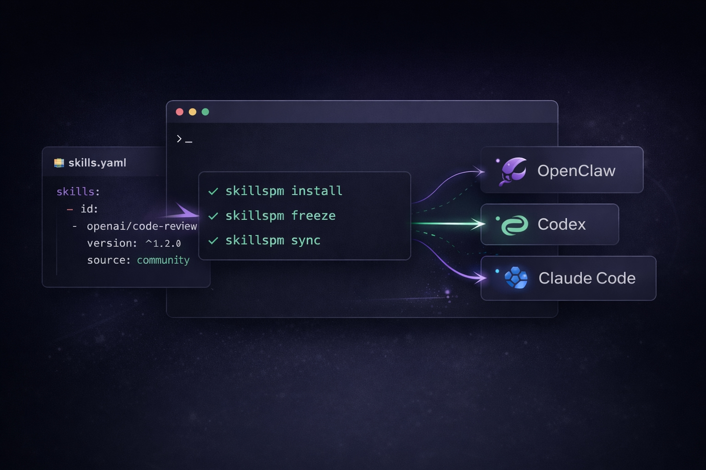

# SkillsPM

<p align="center">
  
</p>

<div align="center">

<h2><code>skills.yaml</code> 是唯一事实来源。</h2>
<p>从它安装、冻结，并在不同 agent 与项目之间同步。</p>


[English](README.md) | 中文

</div>

SkillsPM 用一个 `skills.yaml` 文件作为一套可复用 skills 环境的真相来源。

核心工作流：

- install
- pack
- freeze
- sync
- import
- inspect

## 为什么会有这个工具

AI 编码 Agent 已经越来越擅长使用 skills，但 skill 管理仍然很混乱。

今天，大多数团队仍然在：

- 手工复制 skill 文件夹
- 在多个 agent 之间重复安装相同的 skills
- 搞不清一个 repo 到底依赖哪些 skills
- 创建没有版本号或 metadata 的临时 skill 文件夹
- 很难把一套现有配置从一个 agent 迁移到另一个 agent

SkillsPM 把这些事情变成一个围绕 `skills.yaml` 的可重复工作流。

## 核心命令

### 从 `skills.yaml` 安装一套 skills 环境

```bash
skillspm install
```

### 把当前环境导出成目录 pack

```bash
skillspm pack --out ./packs/team-baseline
```

### 把当前环境冻结到 `skills.lock`

```bash
skillspm freeze
```

### 把已安装的 skills 同步到另一个 agent

```bash
skillspm sync claude_code
```

### 接管已有配置

```bash
skillspm import --from openclaw
skillspm install
```

把已有的 Skills 配置接管进当前受管环境。默认会扫描当前工作目录，以及默认的 OpenClaw skills 目录。

### 把原始文件夹变成可管理的 skill

```bash
skillspm inspect ./my-skill --write
```

## 环境要求

* Node.js 18+（推荐）
* 当前版本优先支持 macOS / Linux

## 安装

默认从 npm 安装最新版本：

```bash
npm install -g skillspm
```

如果你想显式固定某个版本：

```bash
npm install -g skillspm@<version>
```

也可以使用安装脚本；它现在默认也是从 npm 安装：

```bash
curl -fsSL https://raw.githubusercontent.com/sheng-gou/skillspm/main/scripts/install.sh | sh
```

如果你想通过安装脚本固定版本：

```bash
curl -fsSL https://raw.githubusercontent.com/sheng-gou/skillspm/main/scripts/install.sh | SKILLSPM_VERSION=<version> sh
```

如果你想先查看安装脚本内容，再决定是否执行：

```bash
curl -fsSL https://raw.githubusercontent.com/sheng-gou/skillspm/main/scripts/install.sh
```

如果你是为了开发或调试而从源码使用：

```bash
git clone https://github.com/sheng-gou/skillspm.git
cd skillspm
npm install
npm run build
npm link
```

## 快速开始

### 1. 在 `skills.yaml` 里定义你的环境

```yaml
schema: skills/v1

skills:
  - id: local/code-review
    path: ./local-skills/code-review

targets:
  - type: openclaw
    enabled: true
  - type: claude_code
    enabled: true
```

### 2. 安装它

```bash
skillspm install
```

### 3. 同步到 agent

```bash
skillspm sync claude_code
```

### 4. 冻结当前状态

```bash
skillspm freeze
```

## 更高层的 add UX

在 Phase 1 里，更高层的 add 主流程有三类：

* 通过 `add --from <dir>` 添加一个本地 skill 目录
* 通过 `add <provider-ref>` 添加一个显式 canonical 的 skills.sh / ClawHub ref
* 通过 `add <id@range> --from <repo-url>` 从匿名公开 HTTPS repo 添加一个 skill id

显式的本地 index/catalog source 仍然支持，但它更适合作为高级内部兼容路径，而不是主 UX。

### 添加一个本地 skill 目录

```bash
skillspm add --from ./local-skills/code-review
```

这会编译成 `skills.yaml` 里的普通 `path` root 条目。

### 通过显式 skills.sh / ClawHub provider ref 添加

```bash
skillspm add skills.sh:owner/repo/code-review
skillspm add clawhub:owner/repo/code-review
skillspm add https://skills.sh/owner/repo/code-review
```

这会把 canonical provider ref 解析成：

* 一个持久化的 `sources[]` 条目，`type: git`
* 一个持久化的 `sources[].provider.kind`，值为 `skills.sh` 或 `clawhub`
* 一个标准化后的 GitHub clone URL，例如 `https://github.com/owner/repo.git`
* 一个从匹配 skill metadata 推断出来的普通 root skill id
* 一个持久化的 canonical `skills[].provider_ref`

这个 0.3.0 切片故意做得很保守：只支持显式 canonical ref，只支持公开 GitHub-backed 条目，不提供 provider search / private / auth 流程。

### 从匿名公开 HTTPS repo 添加

```bash
skillspm add acme/code-review@^1.2.0 --from https://github.com/example/public-skills.git
```

这会编译成：

* 一个持久化的 `sources[]` 条目，`type: git`
* 一个普通的 root skill，形式为 `id + version + source`

如果你想控制持久化 source 名称，可以额外加 `--source <name>`。private 或需要认证的 repo 仍然不在当前范围内。

### 高级兼容：从本地 index / catalog 添加

```bash
skillspm add acme/code-review@^1.2.0 --from ./catalog
```

你也可以直接指向某个 index 文件，例如 `./skills-index.yaml`。

这会编译成：

* 一个持久化的 `sources[]` 条目，`type: index`
* 一个普通的 root skill，形式为 `id + version + source`

如果某个目录看起来既像本地 skill root，又像 index/catalog 容器，`skillspm add --from <dir>` 现在会按“有歧义”报错。此时应该把 `--from` 指向你真正想添加的 skill 目录，或者直接传入明确的 index 文件路径。

## `skills.yaml`

`skills.yaml` 是一套 skills 环境的真相来源。

它用来声明：

* 这套环境里有哪些 skills
* 这些 skills 从哪里来
* 安装后要同步到哪些 agent / target
* 可选的安装与同步行为

`skillspm install` 会读取 `skills.yaml`，从本地 path 和声明式 source 解析 root skills，也可以从已配置的顶层 `packs[]` 恢复精确版本（包括没有声明 source 的 pack-only restore），最后把安装结果放到本地 `.skills` 工作目录中。

之后：

* `skillspm freeze` 会把解析后的状态写入 `skills.lock`
* `skillspm sync` 会把 `.skills` 中的已安装结果同步到一个或多个 agent

## 可运行示例

仓库里现在有两个可直接运行的示例：

* [`examples/source-aware-live`](examples/source-aware-live/README.md)：展示高级本地 index 兼容流，同时混合一个本地 path skill
* [`examples/pack-transfer`](examples/pack-transfer/README.md)：用显式本地 index fixture 演示可复现的 pack restore

### 最小示例

```yaml
schema: skills/v1

skills:
  - id: local/code-review
    path: ./local-skills/code-review

targets:
  - type: openclaw
    enabled: true
  - type: claude_code
    enabled: true
```

### 带 source 的示例

```yaml
schema: skills/v1

sources:
  - name: community
    type: git
    url: https://github.com/example/public-skills.git

  - name: frontend-catalog
    type: git
    url: https://github.com/acme/provider-skills.git
    provider:
      kind: skills.sh

skills:
  - id: openai/code-review
    version: ^1.2.0
    source: community

  - id: acme/frontend-design
    source: frontend-catalog
    provider_ref: skills.sh:acme/provider-skills/frontend-design

  - id: local/release-check
    path: ./local-skills/release-check

targets:
  - type: openclaw
    enabled: true
  - type: codex
    enabled: true

settings:
  auto_sync: true
```

### `skillspm install` 从哪里安装 Skills

`skillspm install` 只会从 `skills.yaml` 中声明的内容安装 Skills。

Phase 1 的主流程是：

* 本地 path skill
* 声明式的匿名公开 HTTPS git source
* 以 `type: git` + `sources[].provider.kind` 持久化的 provider-backed git source

显式的本地 index/catalog source 仍然支持，但它更偏向内部工作流和测试 fixture 的高级兼容用法。

按当前实现：

* 用 `path` 声明的本地 skill
* 通过 `sources[]` 中声明的 source 解析的 source-backed skill
* 通过 provider UX 添加的 root skill，会在同一 git source 边界上额外持久化 `skills[].provider_ref`
* 通过已配置的顶层 `packs[]` 进行精确版本恢复，包括没有声明 source 的精确版本 pack-only restore

在当前版本里，source 指的是 `sources[]` 里的一个条目。现在支持的 source 类型是：

* 只接受纯仓库 URL 的匿名公开 HTTPS `git`
* 作为显式本地兼容入口的 `index`

pack 是由 `skillspm pack --out <dir>` 写出的一个目录。它不会替代逻辑 source，也不是一种 source type。
当 manifest 声明了精确版本，且某个已配置 pack 中存在完全匹配的 resolved node 时，`install` 可以直接从 pack materialize，而不必再从声明式 source 实时读取。这也支持在没有声明 source 的情况下，对精确版本 root 做 pack-only restore。

这样可以保证安装过程是显式的、可复现的。

如果要看 0.3.0 持久化边界的正式草案，请参考 [`docs/skills-yaml-schema-v0.3.0.md`](docs/skills-yaml-schema-v0.3.0.md)。

### 关键字段

* `schema`：manifest 版本
* `project`：可选的项目级 metadata，其中 `project.name` 也是可选的
* `sources`：可选的声明式 live source，目前支持 `index` 和受限的公开 HTTPS `git`（git 上可选 `provider.kind`）
* `packs`：可选的目录 pack，用于精确版本恢复
* `skills`：这套环境中的根 skills
* `targets`：安装后要同步到哪里
* `settings`：可选行为，例如 `auto_sync`

### skill 的两种常见声明方式

#### 本地 path skill

```yaml
- id: local/code-review
  path: ./local-skills/code-review
```

#### 基于 source 的 skill

```yaml
- id: openai/code-review
  version: ^1.2.0
  source: community
```

#### Provider-backed source skill（带 provider 来源的 skill）

```yaml
- id: acme/frontend-design
  source: frontend-catalog
  provider_ref: skills.sh:acme/provider-skills/frontend-design
```

简单来说：

* 本地 skill 用 `path`
* 普通 source-backed skill 用 `id + version + source`
* 如果 root 是通过 provider-backed git source 添加的，就额外持久化 `provider_ref`
* 想在安装时通过可移植目录包做精确版本恢复（包括 exact root 的 pack-only restore），就在顶层声明 `packs[]`

如果你是在交互式地编写 manifest，`skillspm add ...` 会把本地 skill 目录、显式 canonical 的 skills.sh / ClawHub ref、匿名公开 HTTPS git repo，以及显式本地 index/catalog 兼容 source 写成同样的 manifest 结构。

### 公开 git repo 布局

Phase 1 只支持匿名公开 `https://` git source，并且这类 source 默认只支持一种固定布局。只接受纯仓库 URL：`file://`、`ssh://`、`git@host:repo`、带内嵌凭据的 URL、非空 query string，以及非空 `#` fragment 都会被拒绝。安装时，`skillspm` 会隔离 git 配置、禁用凭据提示与 helper，并阻止 `file://` transport，因此像 `url.*.insteadOf` 这样的环境重写规则不能绕过这条策略。

```text
skills/
└── <skill-id path>/
    └── <version>/
        ├── SKILL.md
        └── skill.yaml
```

例如 `acme/code-review@1.2.0` 的目录应为：

```text
skills/acme/code-review/1.2.0/
```

其中 `skill.yaml.version` 必须与目录版本一致。

显式 canonical 的 `skills.sh:` / `clawhub:` ref 仍然建立在同一套 git 基础之上，但它们的持久化边界会保持可区分。`skillspm add <provider-ref>` 会写入普通的 `type: git` source，再额外写入 `sources[].provider.kind`，同时在 root skill 上保留 `skills[].provider_ref` 作为来源标记。resolver 的行为是显式拆开的：

* 普通 `type: git` source 保持严格模式，只认 `skills/<skill-id path>/<version>`
* 只有持久化了 `provider.kind` 的 `type: git` source，才允许启用保守的 provider-backed fallback locator

这个 provider-backed fallback 会扫描 clone 下来的 repo，寻找一个同时包含 `SKILL.md` 或 `skill.yaml`、并且能唯一匹配请求 skill metadata id 或目录 basename 的 skill 目录（而 `provider_ref` 用于保留 root provenance）。凡是有歧义、格式错误、非 GitHub、依赖搜索、private，或者需要认证的流程都会直接拒绝。

### 同时声明 public HTTPS git + pack restore 的 manifest 示例

```yaml
schema: skills/v1

sources:
  - name: community
    type: git
    url: https://github.com/example/public-skills.git

packs:
  - name: baseline
    path: ./packs/team-baseline

skills:
  - id: acme/code-review
    version: 1.2.0
    source: community

  - id: local/release-check
    path: ./local-skills/release-check
```

另一台机器如果想直接从 pack 恢复，只需要声明相同的精确版本和对应 pack：

```yaml
schema: skills/v1

packs:
  - name: baseline
    path: ./packs/team-baseline

skills:
  - id: acme/code-review
    version: 1.2.0
```

## `skills.lock`

`skills.lock` 用来保存一套 Skills 环境冻结后的解析结果。

如果说 `skills.yaml` 描述的是：

> 我想要什么

那么 `skills.lock` 记录的就是：

> 实际解析并安装成了什么

它最核心的作用，就是锁定这套环境中 Skills 的解析版本和来源谱系，从而让这套环境之后还能被稳定复现，无论是在不同机器、不同仓库，还是不同 Agent 中。

每个 resolved node 现在会同时记录：

* 逻辑来源谱系（`source`）—— 这个 skill 概念上来自哪里
* 实际 materialization 谱系（`materialization`）—— 这次安装到底是 live 拉取，还是从 pack 恢复

大多数情况下，你不需要手工编辑 `skills.lock`。它通常由 `skillspm install` / `skillspm freeze` 生成。

如果存在，`project.name` 只是从 `skills.yaml` 继承过来的可选项目级 metadata。

### 它的用途

* 锁定解析后的 Skills 版本
* 记录每个 Skill 的来源
* 让安装结果可复现
* 帮助人和 Agent 使用同一套环境

### 典型工作流

* 编辑 `skills.yaml`，声明期望的环境
* 运行 `skillspm install`，解析并安装环境
* 运行 `skillspm freeze`，把解析后的状态写入 `skills.lock`

### 一句话理解

* `skills.yaml` = 期望的环境
* `skills.lock` = 冻结后的已安装环境

## 常见工作流

### 管理一个 repo-local 的 skills 环境

```bash
skillspm install
skillspm sync
skillspm freeze
```

### 管理一套全局 skills 基线

这里默认你已经有一个全局的 ~/.skills/skills.yaml。

```bash
skillspm install -g
skillspm sync -g
skillspm freeze -g
```

### 从 OpenClaw 导入现有 skills

```bash
skillspm import --from openclaw
skillspm install
skillspm sync
```

### 规范化一个新创建的 skill 文件夹

```bash
skillspm inspect ./scratch/my-new-skill --write
skillspm install
```

## 它是怎么工作的

### Project scope（默认）

```text
repo/
├── skills.yaml
├── skills.lock
└── .skills/
    ├── installed/
    └── imported/
```

### Global scope（`-g`）

```text
~/.skills/
├── skills.yaml
├── skills.lock
├── installed/
└── imported/
```

推荐用法：

* 默认优先使用 project scope
* 只有在你明确想读写全局环境时才加 `-g`

### 核心文件

* `skills.yaml`：当前作用域的环境声明
* `skills.lock`：冻结后的安装状态

## 命令参考

| 命令                                   | 说明                              |
| ------------------------------------ | ------------------------------- |
| `skillspm install [-g]`                  | 从本地 path、声明式 source 和已配置的精确版本 pack restore 中解析 skills |
| `skillspm update [skill] [-g]`           | 从已配置 source 刷新 root skill 版本，或单独 pin 某个 skill |
| `skillspm pack --out <dir> [-g]`         | 将当前已安装的精确 skills 写成可移植的目录 pack      |
| `skillspm freeze [-g]`                   | 将当前安装状态写入 `skills.lock`                    |
| `skillspm sync [target] [-g]`            | 将已安装的 skills 同步到一个或多个 target           |
| `skillspm import [--from <source>] [-g]` | 从 agent 或本地路径接管现有 skills                   |
| `skillspm inspect <path> --write`        | 为原始 skill 文件夹生成或补全 `skill.yaml`          |

## 其他命令

| 命令                                       | 说明                                            |
| ---------------------------------------- | --------------------------------------------- |
| `skillspm snapshot [--json] [-g]`          | 导出当前 skills 环境                                |
| `skillspm doctor [--json] [-g]`            | 校验 manifest、lockfile、已安装 skills 与 targets 的状态 |
| `skillspm init [-g]`                       | 为 project 或 global scope 生成一个初始 `skills.yaml` |
| `skillspm add [skill] [--from <source>] [-g]` | 向 `skills.yaml` 里添加一个本地或 source-backed 的 root skill |
| `skillspm remove <skill> [-g]`             | 从 `skills.yaml` 里删除一个 root skill              |
| `skillspm list [--resolved] [--json] [-g]` | 查看当前作用域中的 skills                              |
| `skillspm why <skill> [-g]`                | 解释某个 skill 为什么会被安装                            |
| `skillspm target add <target> [-g]`        | 为当前作用域添加一个 target agent                       |
| `skillspm bootstrap [-g]`                  | `install + 按需 auto-sync + doctor` 的快捷命令        |

`skillspm import` 默认会扫描当前工作目录，以及默认的 OpenClaw skills 目录。也可以用 `--from openclaw`、`--from codex`、`--from claude_code` 或 `--from <path>` 指定单一来源。

## 给 agents 的说明

如果一个 repo 包含 `skills.yaml`，agent 通常应该执行：

```bash
skillspm install
skillspm doctor --json
```

如果 targets 已经配置好，agent 还可以执行：

```bash
skillspm sync
```

如果一个新创建的 skill 文件夹缺少 metadata：

```bash
skillspm inspect <path> --write
```

除非用户明确要求，否则 Agent 不应手工编辑 `skills.lock`。

更详细的 agent 说明应写在 `AGENTS.md` 中。

## 当前支持

当前已支持：

* project scope 和 global scope
* manifest + lockfile 工作流
* 本地 path skill
* 受限的公开 HTTPS git source install
* 显式 canonical 的 skills.sh / ClawHub ref，并把它们标准化到公开 GitHub git source 上
* 面向兼容工作流的显式本地 index source install
* 目录 pack 导出，以及通过顶层 `packs[]` 做精确版本恢复
* 从 OpenClaw / Codex / Claude Code / 本地路径导入
* 同步到 OpenClaw / Codex / Claude Code / generic target
* 检查并生成最小化 `skill.yaml`
* 带 JSON 输出的 snapshot 和 list
* 带 JSON 输出的 doctor

## 当前限制

尚未实现或仍有限制：

* private/authenticated git，以及其他非纯 HTTPS git source 流程
* 超出当前本地 index 路径与受限公开 HTTPS git 之外的 remote registry / auth / download 流程
* 超出当前显式 canonical、GitHub-backed skills.sh / ClawHub 适配器范围的托管 catalog 能力（例如搜索、裸短名 ref、private 条目）
* 新 skill 的自动依赖推断
* 更深入的 host compatibility rules

## 开发

```bash
npm install
npm test
```

关于维护者：见 [HUMAN.md](HUMAN.md)
